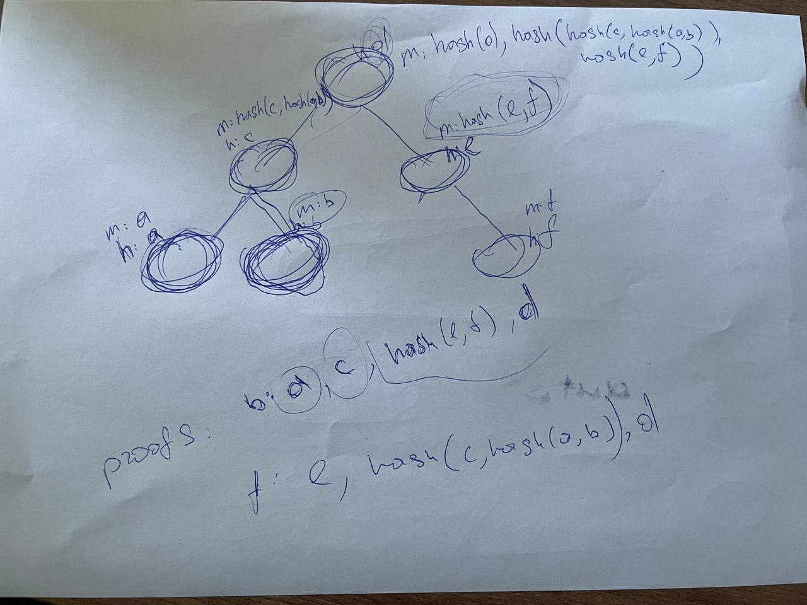

# Treap-based dynamic Merkle tree

Proof of concept for dynamic Merkle tree. 
Treap as primary data structure used ao achieve logarithmic inserting/removing.

Treap description: "<https://en.wikipedia.org/wiki/Treap>"

Merkle tree description: "<https://en.wikipedia.org/wiki/Merkle_tree>"

